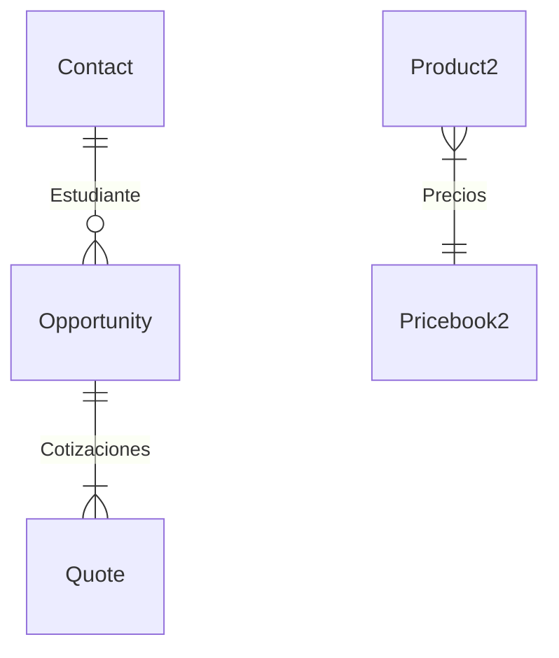

# Sistema de Cobranza Universitaria - Meta 1
Implementación del sistema de cobranza universitaria en Salesforce, enfocado en la gestión de estudiantes, materias y proceso de inscripción.

## 📖 Contenido
- [Descripción General](#descripción-general)
- [Configuración Técnica](#configuración-técnica)
  - [Objetos y Campos](#objetos-y-campos)
  - [Reglas de Validación](#reglas-de-validación)
- [Pruebas](#pruebas)
- [Capturas de Pantalla](#capturas-de-pantalla)

## Descripción General
Primera fase del sistema de cobranza universitaria que incluye la configuración base de objetos y campos necesarios para gestionar estudiantes, materias y procesos de inscripción.

## Configuración Técnica

### Objetos y Campos

#### Contact (Estudiante)
| Campo | Tipo | Descripción | Valores |
|------|------|-------------|----------|
| Matrícula | Auto Number | ID único del estudiante | Formato: EST-{00000} |
| Estado | Picklist | Sede del estudiante | Guanajuato, Nuevo León, Jalisco, Querétaro |
| Periodo | Picklist | Tipo de periodo | Semestral, Cuatrimestral |
| Fecha de Nacimiento | Date | Fecha de nacimiento | - |
| Promedio | Number(3,1) | Promedio del estudiante | Rango: 0-10 |

#### Product2 (Materia)
| Campo | Tipo | Descripción | Valores |
|------|------|-------------|----------|
| Código Materia | Text | Código identificador | - |
| Periodo | Picklist | Tipo de periodo | Semestral, Cuatrimestral |

#### Pricebook2 (Listas de Precios)
Configuración de precios por sede:
- Lista de Precios Guanajuato: $17,000
- Lista de Precios Nuevo León: $18,000
- Lista de Precios Jalisco: $13,000
- Lista de Precios Querétaro: $15,000

#### Opportunity (Inscripción)
| Campo | Tipo | Descripción | Valores |
|------|------|-------------|----------|
| Estudiante | Lookup(Contact) | Relación con estudiante | - |
| Cantidad_de_Materias | Number | Número de materias | - |
| Forma de Pago | Picklist | Método de pago | Mensualidades, Contado |

#### Quote (Cotización)
| Campo | Tipo | Descripción | Valores |
|------|------|-------------|----------|
| Campus | Picklist | Sede de la cotización | Guanajuato, Nuevo León, Jalisco, Querétaro |
| Número de Materias | Number | Cantidad de materias | - |
| Tipo de Beca | Picklist | Tipo de beca aplicable | Ninguna, Excelencia, Necesidad Económica, Familiar Docente |
| Estado de Cotización | Picklist | Estado del proceso | Borrador, En Revisión, Aprobada, Rechazada, Enviada |

### Reglas de Validación

#### Limite_Materias_Por_Periodo (en Opportunity)
Valida que no se excedan los límites de materias según el periodo del estudiante.

```apex
OR(
    AND(
        ISPICKVAL(Estudiante__r.Periodo__c, "Semestral"),
        Cantidad_de_Materias__c > 7
    ),
    AND(
        ISPICKVAL(Estudiante__r.Periodo__c, "Cuatrimestral"),
        Cantidad_de_Materias__c > 4
    )
)
```

**Mensaje de Error:** El número de materias excede el límite permitido para el periodo seleccionado. Semestral: máximo 7 materias. Cuatrimestral: máximo 4 materias.

### Relaciones entre Objetos


## Pruebas

### Casos de Prueba Ejecutados

#### Validación de Límite de Materias
1. **Periodo Semestral - Límite Excedido**
   - Input: 8 materias
   - Resultado: ✅ Error mostrado correctamente

2. **Periodo Cuatrimestral - Límite Excedido**
   - Input: 5 materias
   - Resultado: ✅ Error mostrado correctamente

3. **Inscripción Válida Semestral**
   - Input: 6 materias
   - Resultado: ✅ Inscripción creada exitosamente

4. **Inscripción Válida Cuatrimestral**
   - Input: 4 materias
   - Resultado: ✅ Inscripción creada exitosamente

### Resultados de Usabilidad
- ⭐⭐⭐⭐ Facilidad de Uso
- ⭐⭐⭐⭐⭐ Claridad de Mensajes
- ⭐⭐⭐⭐ Eficiencia del Proceso

## Capturas de Pantalla
[Nota: Agregar capturas de pantalla relevantes mostrando la configuración y funcionalidad]

### Ubicaciones Sugeridas para Capturas:
1. Object Manager - Visión general
2. Configuración de campos en Contact
3. Configuración de campos en Opportunity
4. Listas de precios configuradas
5. Configuración de Product2 (Materia)
6. Regla de validación en Opportunity
7. Formulario de nueva Inscripción
8. Vista de lista de Price Books
